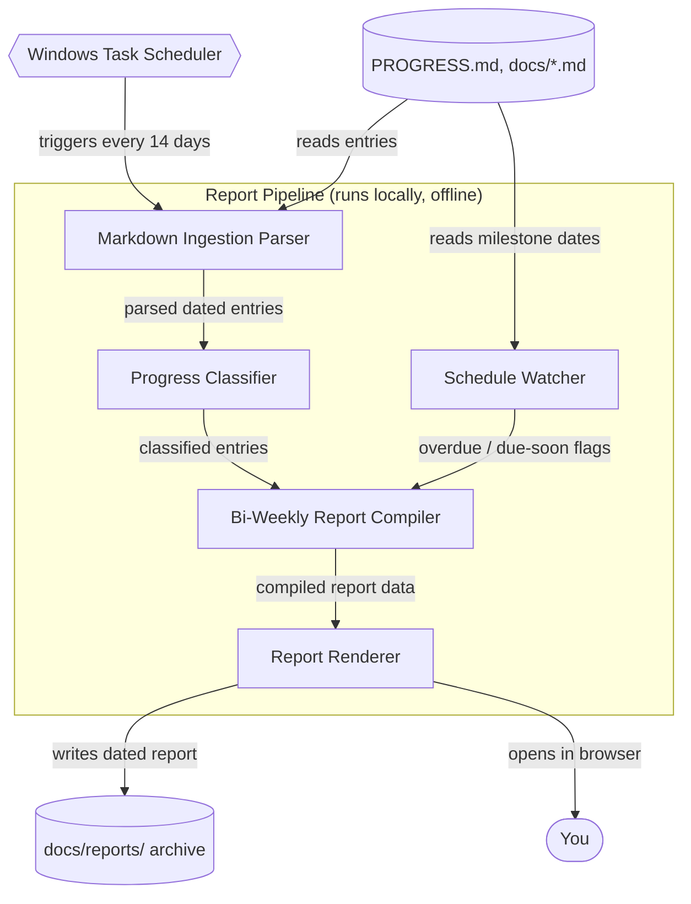

# Architecture: Bi-Weekly Progress Reporter

## The Idea

> A personal project management system for my AI-Project workspace. It's for me alone — no team, no separate task list. It monitors my project schedule and tracks plan/task progress by reading the markdown I already keep (PROGRESS.md, docs/ARCHITECTURE.md, and similar docs in this repo). The one thing it must do well on day one: reliably generate a bi-weekly report — what shipped, what's behind, what's next — every two weeks, without me having to remember to run it.

## Components

| Component | What it does for this project | Words in the idea that required it |
|---|---|---|
| **Markdown Ingestion Parser** | Reads `PROGRESS.md` and the other markdown docs in the repo and pulls out each dated entry as a structured record. | "reading the markdown I already keep (PROGRESS.md, docs/ARCHITECTURE.md, and similar docs)" |
| **Progress Classifier** | Looks at each parsed entry and labels it Shipped, In Progress, or Blocked, then sorts it into the two-week window it belongs to. | "tracks plan/task progress" |
| **Schedule Watcher** | Scans the same docs for any dated milestones or phases and flags the ones that are overdue or due before the next report. | "monitors my project schedule" |
| **Bi-Weekly Report Compiler** | Takes the classified entries and schedule flags and assembles them into exactly three sections: what shipped, what's behind, what's next. This is the day-one component — everything else exists to feed it. | "the one thing it must do well on day one: reliably generate a bi-weekly report — what shipped, what's behind, what's next" |
| **Report Renderer** | Turns the compiled data into a readable, styled report file (HTML plus a plain markdown copy) and opens it. | "generate a bi-weekly report" |
| **Report Archive** *(data store)* | A dated folder (`docs/reports/<date>/`) where every generated report is saved, so nothing gets overwritten and past reports stay browsable. | "reliably" (a report that isn't kept isn't reliable) |
| **Bi-Weekly Scheduler** *(third party — Windows Task Scheduler)* | Triggers the whole pipeline automatically every 14 days, on this machine, with no manual step. | "every two weeks, without me having to remember to run it" |
| **Your Markdown Docs** *(existing data store, not built)* | `PROGRESS.md`, `docs/ARCHITECTURE.md`, and similar — the existing source of truth this system only reads, never rewrites. | "the markdown I already keep" |

No frontend app, database, queue, or external network service was added — this is a single-user, offline, file-reading pipeline, so none of those are implied by the idea. No AI/LLM layer was added either: the report is assembled deterministically from what's already written in your docs, in keeping with this workspace's own principle that "LLMs are probabilistic, production systems must be deterministic" (see the root `CLAUDE.md` Core Principle — even though that file is a mismatched Colaberry copy in this repo, the reasoning still applies here).

## How It Fits Together

## Data Flow

1. Every 14 days, **Windows Task Scheduler** runs the report pipeline with no action from you.
2. The **Markdown Ingestion Parser** reads `PROGRESS.md` and the other repo docs and extracts each dated entry as a structured record.
3. The **Progress Classifier** labels each entry Shipped / In Progress / Blocked and bins it into the current two-week window.
4. The **Schedule Watcher** scans the same docs for dated milestones and flags anything overdue or due before the next report.
5. The **Bi-Weekly Report Compiler** merges the classified entries and the schedule flags into the three required sections.
6. The **Report Renderer** writes a styled HTML report and a plain markdown copy into `docs/reports/<date>/` (the **Report Archive**).
7. The renderer opens the new report in your browser so you see it immediately, with no need to go looking for it.

## Build Order

| Phase | Proves | What ships |
|---|---|---|
| **1. Parser** | The system can actually read your real `PROGRESS.md` and extract structured entries without misparsing your existing writing style. | Markdown Ingestion Parser, run manually against real files. |
| **2. Classifier + Watcher** | Entries can be reliably labeled and milestone dates correctly compared to today. | Progress Classifier, Schedule Watcher. |
| **3. Compiler + Renderer** *(make-or-break phase)* | A real, readable bi-weekly report can be assembled end-to-end from real data — this is the day-one requirement. | Bi-Weekly Report Compiler, Report Renderer, one report generated manually. |
| **4. Scheduler** | The report generates itself on the 14-day cadence with zero manual steps — "reliably... without me remembering." | Windows Task Scheduler trigger wired to the pipeline. |
| **5. Archive & polish** | Reports accumulate over time and stay easy to find and re-open. | `docs/reports/` convention, styling pass. |

Phase 3 is the one that must not slip — every other phase exists to make it automatic and trustworthy, not to make it possible.

## Assumptions

| Assumption | Impact if wrong |
|---|---|
| `PROGRESS.md` entries keep a reasonably consistent `## YYYY-MM-DD` heading + bullet-list format going forward. | If the format drifts, the parser needs a matching rule update or entries silently get skipped. |
| "Bi-weekly" means every 14 calendar days from a fixed anchor date, not calendar-aligned to the 1st/15th of the month. | If you actually want calendar-aligned periods, both the scheduler trigger and the compiler's windowing logic change. |
| No one but you ever needs to see the report (no email, no Slack, no shared drive). | If that changes, an external delivery component (email/Slack) gets added — today's design has none, on purpose. |
| Windows Task Scheduler is an acceptable trigger, since this runs on your own machine, not a server. | If this ever needs to run on a server or in CI instead, the scheduler component is swapped for a cron/CI-schedule equivalent. |

## What This Design Does Not Cover

- Projects outside this workspace — scope was locked to "this workspace only," so it will not discover or report on other repos.
- Multiple users, permissions, or sharing — it assumes one reader: you.
- Authoring or editing progress notes — it only ever reads `PROGRESS.md`/docs; it will never rewrite your source notes.
- Re-classifying old reports if your entry format changes later — past reports are frozen as generated, not regenerated retroactively.
- Any notification channel (email, Slack, push) — the report is a local file you open, nothing is sent anywhere.
