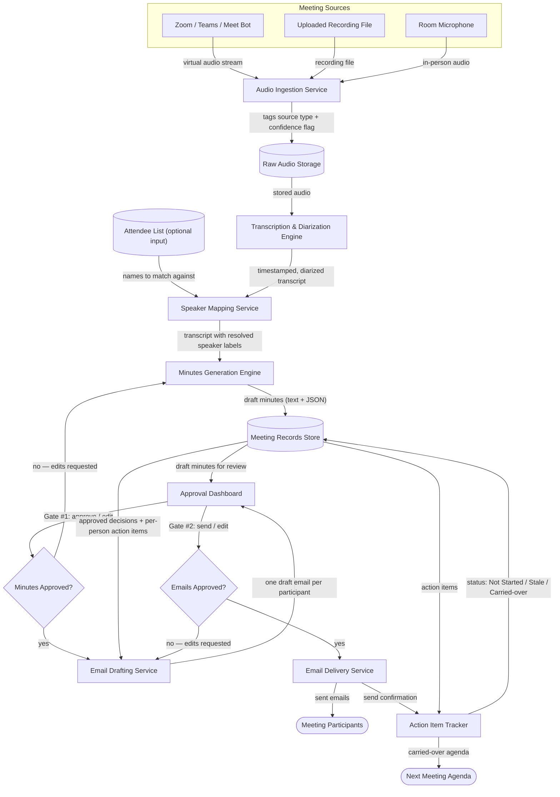

# Architecture: AI Meeting Assistant

## Idea

> An AI meeting assistant responsible for turning raw audio from virtual or physical meetings into accurate transcripts, structured minutes, tracked action items, and participant-specific email distribution. Pipeline: (1) Ingest audio from Zoom/Teams/Meet bot, recording file, or room mic — tag source type (Virtual/In-Person) and flag noisy/physical audio for lower confidence. (2) Transcribe into a timestamped transcript with speaker diarization, mapping speakers to attendee names when a list is given, else "Unidentified Speaker"; mark unclear audio as [inaudible]/[unclear], never fabricate. (3) Generate minutes: summary, discussion points by topic with timestamps, numbered decisions with rationale/approver/timestamp, an action items table (Item/Owner/Due Date/Priority/Status/Timestamp), and a next-meeting proposal with carried-over items. (4) Gate #1: present draft minutes for human approval before any email drafting. (5) After approval, draft one personalized email per participant containing the shared summary/decisions plus only their own action items. (6) Gate #2: present all emails for human approval before sending. (7) Post-send: log action items as "Not Started," flag stale items (>2 weeks open) for recurring meetings, and build a carried-over agenda list. Core rules: never fabricate content, two separate human approvals required before any email is sent, consistent speaker labels throughout, and dual output (human-readable text + structured/JSON data) at every stage.

## Components

- **Audio Ingestion Service** — Accepts the meeting recording, however it arrives (a Zoom/Teams/Meet bot feed, an uploaded file, or a room microphone), labels it as Virtual or In-Person, and flags physical-room audio as lower-confidence before anything else touches it.
- **Raw Audio Storage** — Holds the original audio file untouched, so the recording that was actually captured can always be re-checked against the transcript later.
- **Transcription & Diarization Engine** — Turns the audio into a timestamped, speaker-separated transcript, marking any audio it can't make out as [inaudible]/[unclear] instead of guessing at words.
- **Speaker Mapping Service** — Matches each diarized speaker to a name from the attendee list if one was provided; if a speaker can't be confidently matched, it stays labeled "Unidentified Speaker" everywhere, consistently.
- **Minutes Generation Engine** — Reads the finished transcript and drafts the structured minutes: the summary, topic-by-topic discussion points, numbered decisions with rationale and approver, the action items table, and the next-meeting proposal — grounded only in what the transcript actually contains.
- **Meeting Records Store** — Keeps the transcript, the minutes, and every action item as structured data (with a parallel JSON copy), so nothing downstream — emails, status tracking, next agenda — has to re-derive facts from scratch.
- **Approval Dashboard** — The screen where a human reviews the draft minutes (Gate #1) and, later, the drafted emails (Gate #2); nothing moves to the next stage until this dashboard records an explicit approval or edit.
- **Email Drafting Service** — Once minutes are approved, writes one email per participant containing the shared summary and decisions plus only that person's own action items — never anyone else's.
- **Email Delivery Service** — Sends the emails, but only after Gate #2 approval; this is the only component allowed to actually dispatch outbound mail.
- **Action Item Tracker** — After sending, logs every action item as "Not Started," watches recurring meetings for items still open after two weeks and flags them stale, and assembles the carried-over list for the next meeting's agenda.

No AI/LLM step is allowed to run past Gate #1 or Gate #2 unsupervised — both gates are hard stops owned by the Approval Dashboard, not by the generation engines.

## Data Flow

